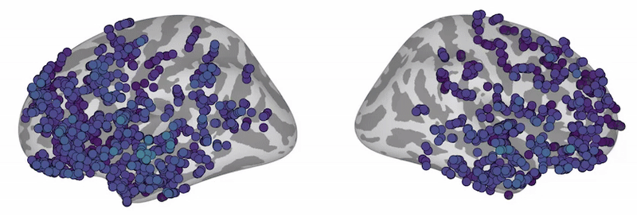

# Neuroprobe: Evaluating Intracranial Brain Responses to Naturalistic Stimuli
Andrii Zahorodnii¹²*, Bennett Stankovits¹*, Christopher Wang¹*, Charikleia Moraitaki¹, Geeling Chau³, Ila R Fiete¹², Boris Katz¹, Andrei Barbu¹



¹MIT CSAIL, CBMM  |  ²MIT McGovern Institute  |  ³Caltech  |  *Equal contribution

### Abstract
Understanding the relationship between the various tasks the brain performs can shed light on its functional organization. We introduce a benchmark, Neuroprobe, which targets a wide range of multimodal tasks. Neuroprobe borrows several ideas from modern natural language processing: using large scale naturalistic datasets, probing at scale across tasks as a means to understand black box systems, and evaluating on large benchmarks that test many different skills. For artificial networks, probe analysis attempts to decode attributes from different layers. It is one of the main vehicles used to shed light on the relationship and dependencies between tasks and the algorithms that networks learn. While prior neuroscience benchmarks tend to focus on a single or a very small number of tasks, Neuroprobe uses a fixed set of subjects with a large amount of data across many annotated tasks, which will allow us to create an integrated picture. Furthermore, the results obtained from Neuroprobe evaluations can yield time-orderings between different tasks and recover the functional relationships between tasks that reveal properties of the algorithms the brain uses. The main remaining bottleneck to achieving these type of results is that decoding performance for many tasks is very poor. We demonstrate a few tasks both with simple linear decoders and neural foundation models, then introduce a large number of additional attributes that should, in principle, be decodable but are not. Neuroprobe gives us an opportunity to build higher accuracy decoders, better neural foundation models that are tested across many tasks, and to bring neuroscience closer to the methodology that has worked so well in natural language understanding, and to ultimately discover the functional organization of the brain across many tasks.

### Key Features
- 19 standardized decoding tasks spanning vision, audio and language domains
- High temporal resolution intracranial recordings from 10 human subjects
- 43 hours of neural activity aligned with movie stimuli
- Standardized train/test splits and evaluation metrics
- Public leaderboard for tracking model progress
- Focus on naturalistic language processing and brain responses

### Links
- Leaderboard: https://neuroprobe.dev
- Technical paper: [Click here](https://azaho.org/papers/NeurIPS_2025__BTBench_paper.pdf)


## Getting Started

Optionally, create a virtual environment:
```
python -m venv .venv
source .venv/bin/activate
pip install --upgrade pip
```

1. Install required packages:
```
pip install beautifulsoup4 requests torch torchvision h5py pandas scipy numpy matplotlib seaborn wandb scikit-learn psutil librosa
```

2. Specify the path to the braintreebank dataset (or the path to download it to) in the `neuroprobe_config.py` file: 
```
ROOT_DIR = "braintreebank" # Root directory for the braintreebank data
```
Then, download and extract the braintreebank dataset (this step can be skipped if the dataset is already downloaded and extracted; it should be all extracted into the ROOT_DIR directory):
```
python braintreebank_download_extract.py
```

3. Then, you use the file `quickstart.ipynb` to see how to create a dataset and evaluate a linear model.

## Using our evaluation scripts

To evaluate the linear regression model on all electrodes and time bins separately, run (for example):
```
python single_electrode.py --subject SUBJECT_ID --trial TRIAL_ID --verbose --lite --eval_name onset --splits_type SS_DM
```
This command will create a JSON file in the `eval_results` directory with the results, according to the schema in `leaderboard_schema.json`. You can change the `save_dir` argument to save the results to a different directory: `--save_dir SAVE_DIR`.

## Citation

If you use Neuroprobe in your work, please cite the following paper:
TBD